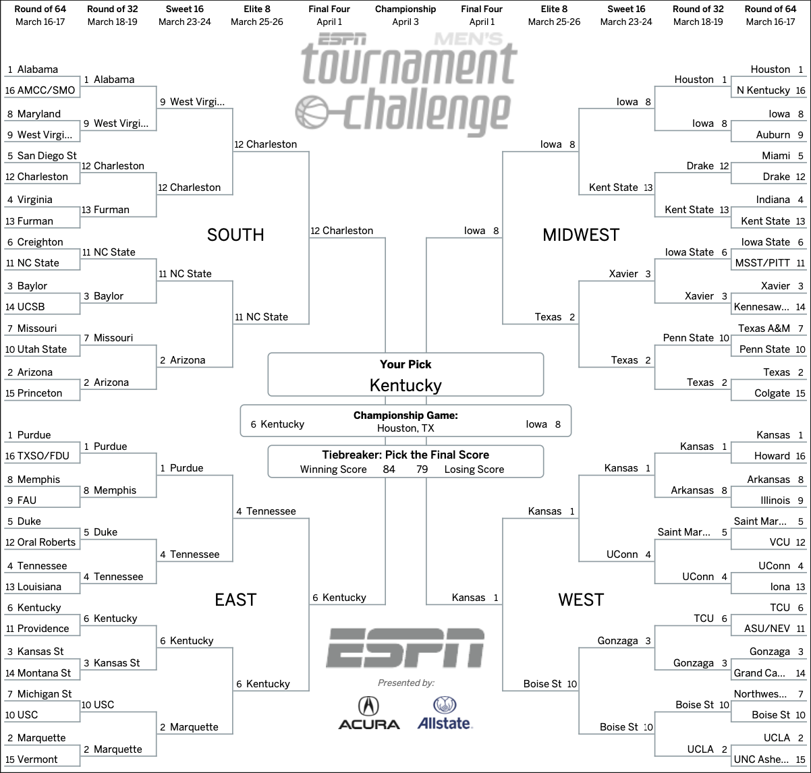

# March Madness AI
Train the OpenAI API on the results of every March Madness game since 1985, then use the model to predict the outcome of this year's tournament. Great for learning how OpenAI's [fine-tuning](https://platform.openai.com/docs/guides/fine-tuning) works.

Credits to [danvk](https://github.com/danvk/march-madness-data) for providing the data necessary to train the model.

## Getting Started

1. Install [Node.js](https://nodejs.org/en/download/), [Yarn](https://classic.yarnpkg.com/lang/en/docs/install/), & other system dependencies.
2. Install OpenAI's CLI ([OpenAI's CLI](https://platform.openai.com/docs/guides/fine-tuning)) locally. This is so you can train your own model. Make sure to set your OpenAI API key as instructed in the article linked above.
3. Clone this repo, and run `yarn` to install package dependencies.

## Training the Model

In order to train a model based on Davinci, we'll need to create a JSONL file containing the training data. This is done by running `yarn run prepare`. This will create a file called `training-data.jsonl` in the root directory with the results of every March Madness game since 1985.

Now that the training data is ready, we can train the model by running `yarn run train`. This will take a while, but timing depends on the size of the queue at the time of training– it could take around 90 minutes during peak hours. You can read more about the training process [here](https://platform.openai.com/docs/guides/fine-tuning).

Once your model is fully trained, you'll be given a model ID that looks something like `davinci:ft-personal-0000-00-00-00-00-00`.

## Setting Environment Variables

In order to get predictions, you'll need to set environment variables in the `.env` file. You can do this by running `cp .env.example .env` and then filling in the values.

1. `OPENAI_API_KEY`: Your OpenAI API key. You can find this in your [OpenAI dashboard](https://beta.openai.com/account/api-keys).
2. `OPENAI_MODEL_ID`: The model ID you were given when your model finished training, as described above.
3. `DEBUG_MODE`: Set this to `true` if you want to avoid calling the OpenAI API and instead use a random number generator to generate predictions. This is useful for testing the app without using up your API credits.

## Running Predictions

Now that you have a trained model and have set your local environment variables, you can run predictions by running `yarn run predict`. This will generate predictions for every game in this year's tournament. It will begin to output the results of each round as they are completed.

Finally, the results are saved to a file called `bracket.txt`. You can view the results by running `cat bracket.txt`.

Based on my results, here is a screenshot of the final bracket:

